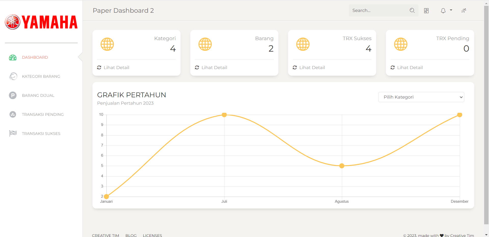
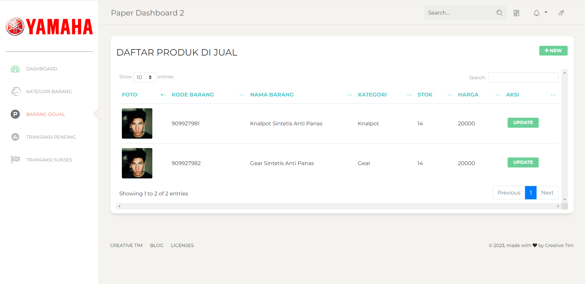
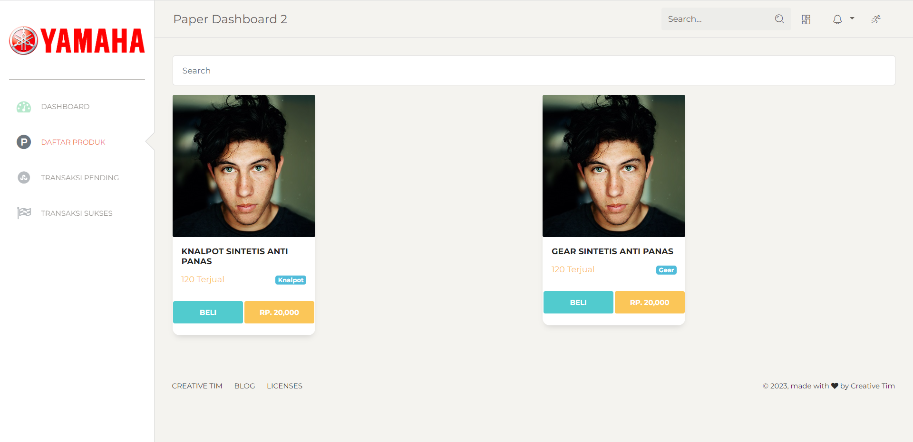
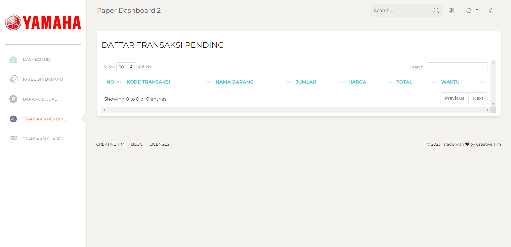
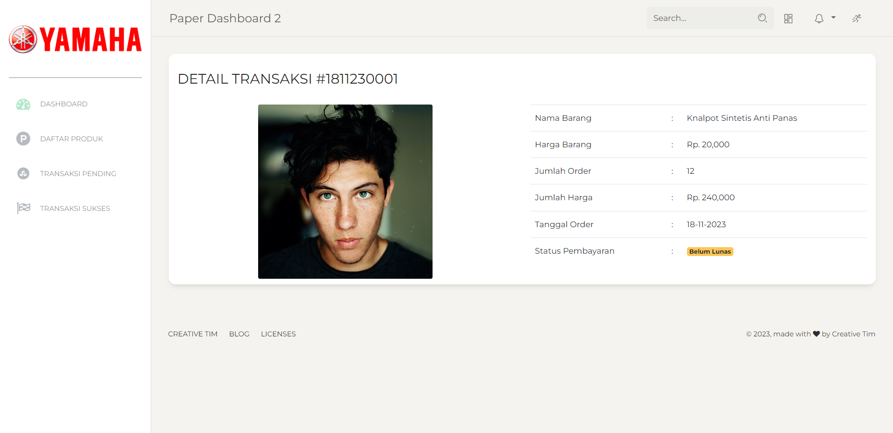
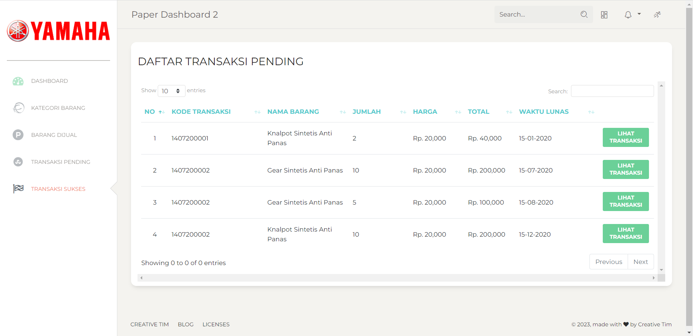
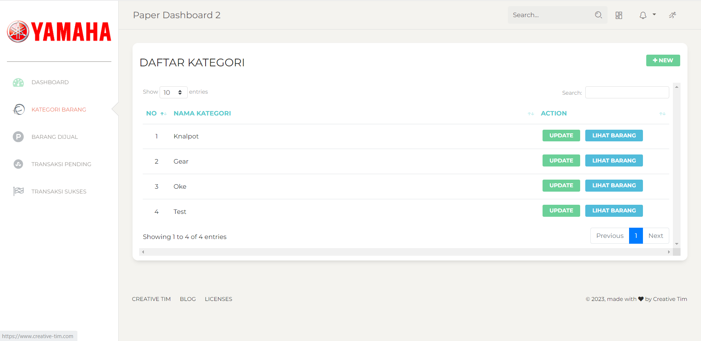

# Penjualan Sparepart - Proyek Belum Selesai

Selamat datang di repositori Penjualan Sparepart! Proyek ini adalah sistem penjualan sparepart yang memungkinkan pengguna untuk mengelola produk, transaksi, dan kategori. Meskipun proyek ini belum selesai, Anda dapat mengeksplorasi dan mengembangkan lebih lanjut.

## Fitur

1. **Dashboard**: Ringkasan visual dari statistik dan informasi utama.
2. **Produk**: Manajemen produk untuk sparepart yang tersedia.
3. **Daftar Produk Dijual**: Penampilan daftar produk yang dijual.
4. **Transaksi Pending**: Menampilkan transaksi yang belum selesai atau tertunda.
5. **Detail Transaksi**: Rincian lengkap dari setiap transaksi.
6. **Transaksi Sukses**: Daftar transaksi yang telah berhasil diselesaikan.
7. **Kategori**: Pengelolaan kategori untuk produk.

## Screenshot

### 1. Dashboard

### 2. Produk

### 3. Daftar Produk Dijual

### 4. Transaksi Pending

### 5. Detail Transaksi

### 6. Transaksi Sukses

### 7. Kategori

## Role Akses

1. **Admin**: Akses penuh ke semua fitur dan pengaturan aplikasi.
2. **Manajer**: Akses terbatas sesuai dengan kebutuhan manajerial.
3. **Konsumen**: Akses terbatas untuk melakukan transaksi dan melihat produk.

## Instalasi

1. Clone repositori ini: `git clone https://github.com/inotechno/penjualan-sparepart.git`
2. Impor struktur database dari `spsc.sql`.
3. Konfigurasi file `application/config/database.php` untuk pengaturan koneksi database.

## Kontribusi

Proyek ini belum selesai, namun kontribusi Anda tetap sangat dihargai. Jika Anda tertarik untuk berkontribusi atau melaporkan masalah, silakan buka issue atau pull request.

## Lisensi

Diberikan di bawah lisensi MIT - Lihat [LICENSE](LICENSE) untuk lebih lanjut.
